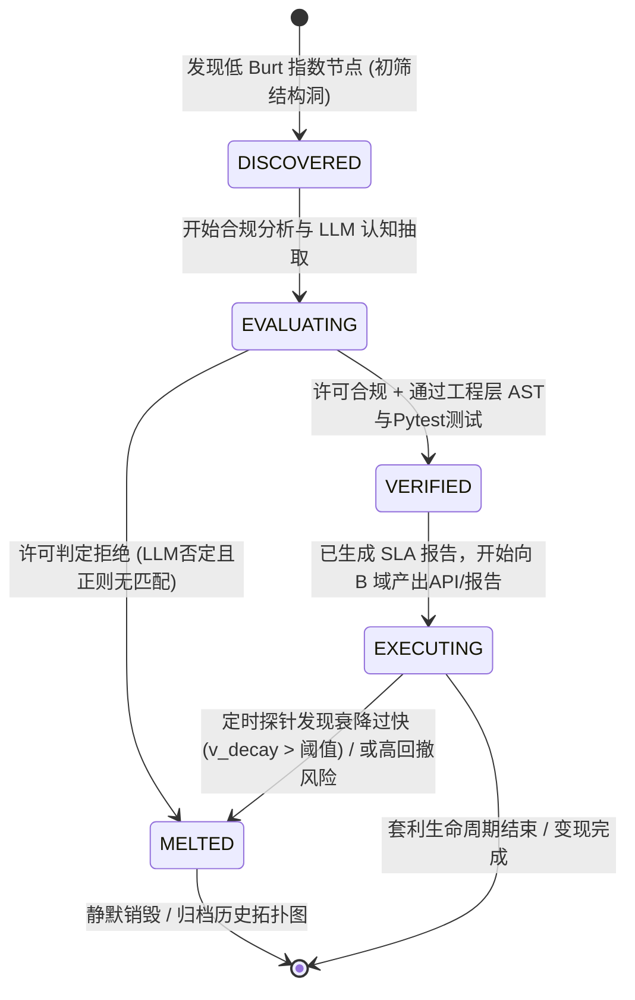

# 技术架构设计文档 (TDD)：反脆弱结构洞引擎 v2.0

## 1. 总体架构与层次设计 (5-Tier Architecture)

系统整体采用**单进程异步事件驱动 + 分层管道式（Pipeline）架构**，由于无需物理隔离，整个系统以大吞吐量的协程为底座，穿插计算密集（图运算）和 I/O 密集（爬虫、LLM）任务。

```mermaid
graph TD
    subgraph Data_Sources ["数据源 (Data Sources)"]
        DA[A域: 开源社区/Github]
        DB[B域: 商业论坛/需求池]
    end

    subgraph L1 ["1. 数据摄取与合规层 (Sensory & Compliance)"]
        RL[全局异步令牌桶<br>Token Bucket Limiter]
        Crawler[aiohttp 异步爬虫集群]
        Cleaner[正则/NLP 数据清洗]
        LicenseBypass[许可是/否判定树<br>正则静态扫描 + LLM判定]
        
        RL -. 控制限流 .-> Crawler
        Crawler --> Cleaner --> LicenseBypass
    end

    subgraph L2 ["2. 图谱分析与衰变层 (Graph Computing)"]
        NX[(NetworkX 内存有向图)]
        Pruner((后台进程<br>TTL边剪枝))
        Burt[Burt约束指数计算<br>定位结构洞]
        Decay[衰变率 v_decay 探针]
        
        NX <--> Pruner
        NX <--> Burt
        NX <--> Decay
    end

    subgraph L3 ["3. 认知与风控决策层 (Cognitive & Decision)"]
        Context[上下文提炼器]
        LLM[LLM 网关模块 (Gemini)]
        JSON[强制 JSON 结构化解析<br>包含利润率/最大回撤等]
        
        Context --> LLM --> JSON
    end

    subgraph L4 ["4. 工程增信层 (Engineering Validation)"]
        AST[AST 安全扫描<br>过滤危险原生调用]
        TestGen[LLM 测试用例生成]
        Pytest[原生 Pytest 子进程执行]
        SLA[SLA 容灾与稳定性报告生成]
        
        AST --> TestGen --> Pytest --> SLA
    end

    subgraph L5 ["5. 变现与熔断执行层 (Execution & Breaker)"]
        Packager[变现封装<br>API/SAAS/情报报告]
        RiskRouter{最大回撤探测 /<br>多域敏感操作}
        HITL[人类在环审批<br>Webhook/飞书/钉钉]
        Terminal([SLA 兜底溢价输出])
        
        Packager --> RiskRouter
        RiskRouter -- 超出安全垫 --> HITL
        RiskRouter -- 风险可控 --> Terminal
        HITL -- 人工放行 --> Terminal
    end

    %% 数据流转链接
    DA --> Crawler
    DB --> Crawler
    LicenseBypass -- 合法节点/边 --> NX
    Burt -- 初筛结构洞 --> Context
    JSON -- 代码/算法类实体 --> AST
    SLA --> Packager
```

## 2. 系统状态机与生命周期流转 (State Machine)

一个结构洞（套利机会）在系统中的生命周期由有限状态机严格控制，配合 TTL 修剪和衰变探针：



## 3. 核心大模型认知网关设计 (LLM Gateway Design)

### 3.1 模型选型：Gemini 3.1 Flash Lite Preview
在认知与风控层，我们指定使用 **`gemini-3.1-flash-lite-preview`** 模型。
- **高频异步流极佳适配**：在海量节点过滤任务中，Flash Lite 具备极低的 TTFT (首Token时间) 与吞吐开销，完美契合 `asyncio` 单进程的高并发要求。
- **长文本理解**：在工程增信层，需要把源码喂入给模型生成测试用例并分析代码意图，Flash Lite 拥有极强的长文本逻辑统筹能力。

### 3.2 原生结构化输出 (JSON)
为了完全消除正则匹配从文本中提取字段带来的脆弱性，我们会启用 Gemini 专属特性：`response_mime_type="application/json"`。
在 API 层强制模型返回标准的 JSON 对象响应，字段必须包含：`compliance_status`, `pitch_script`, `expected_margin`, `max_drawdown`, `execution_steps`。

### 3.3 异步 IO 包装
为防止因模型请求阻塞主线程，所有对 Gemini REST API 或 SDK 的请求均通过自行封装的 `aiohttp` 或 `asyncio.to_thread` 执行。

## 4. 核心数据结构与图谱模式 (Data Schema & Graph Modeling)

基于纯 Python 的 `NetworkX`（`DiGraph` 有向图），需为节点（Node）和边（Edge）定义严格属性，支撑衰变计算：

### 4.1 节点 (Node) 属性定义
|**属性键名**|**类型**|**描述**|**示例**|
|---|---|---|---|
|`node_id`|`str`|唯一标识符（URL 哈希或 URN）|`urn:github:repo:user/project`|
|`domain`|`str`|所属圈层（A域/开源，B域/商业）|`Domain_A_Crypto`|
|`node_type`|`str`|实体类别|`repository`, `developer`, `forum`|
|`license`|`str`|许可协议类型|`MIT`, `GPL-3.0`, `UNKNOWN`|
|`timestamp`|`float`|最后活跃时间（Unix 时间戳）|`1711584000.0`|

### 4.2 边 (Edge) 属性与 TTL 机制
|**属性键名**|**类型**|**描述**|**示例**|
|---|---|---|---|
|`weight`|`float`|连接强度（流通量/同现频次）|`0.85`|
|`discovered_at`|`float`|首次探测到该连接的时间戳|`1711584000.0`|
|`ttl`|`float`|边缘存活周期（单位：秒）|`259200` (72H)|
|`last_seen`|`float`|最后一次验证边存在的时间|`1711590000.0`|

## 5. 并发限流与调度机制 (Concurrency & Rate Limiting)

采用 **全局令牌桶 (Token Bucket) + `asyncio` + `aiohttp`** 架构以防止爬虫被封禁。

### 5.1 异步令牌桶逻辑
- 维护全局 Token 池，以恒定速率填充。
- `aiohttp` 发起请求前，强制调用 `await bucket.consume(1)`，无 Token 则挂起等待。

### 5.2 架构映射伪代码
```python
class AsyncTokenBucket:
    # 内部使用 asyncio.Lock() 保证单进程协程安全
    # 基于系统时间差(time.monotonic)懒加载补充 Token
    pass

class RateLimitedSession:
    # 封装 aiohttp.ClientSession，在 request() 注入限流锁
    pass
```

## 6. 核心算法与决策流 (Core Algorithm Flow)

### 6.1 动态结构洞衰变与熔断 (Decay & Breaker)
后台运行 Pruning Task（定期清理任务）：
1. **TTL 修剪**：`now() > edge['last_seen'] + edge['ttl']` 则删边。
2. **衰变率监控**：若两节点间最短路径快速缩短 $v_{decay} > \text{Threshold}$，视其为内卷化，转移至 `MELTED`。
3. **Burt 约束指数发现**：针对图中剩余节点计算约束指数 $C_i = \sum_{j} \left( p_{ij} + \sum_{q} p_{iq} p_{qj} \right)^2$，选取极值作为最新套利点。

### 6.2 许可“幻觉绕过”决策树 (License Bypass)
双保险防止 LLM 幻觉产生误判：
- **静态正则**：提取白名单高频字句（`MIT License` 等）。
- **LLM 语义判断**：输出 `is_commercial_allowed`。
- **裁决树**：如果 LLM 说 False，但正则强烈匹配，则触发**强制绕过 (Override Bypass)**，放行进入验证层。

## 7. 工程增信测试层设计 (Engineering Validation)

摒弃复杂的 Docker 沙盒，利用原生环境的敏捷性获取 SLA 增信：
1. **代码清洗与 AST 隔离**：利用 `ast` 解析 Python 源码，剔除 `os.system`、`subprocess.Popen` 等危险调用。
2. **大模型动态测例**：LLM 生成 3-5 个 `pytest` 用例。
3. **原生环境执行**：运用 `subprocess.run(['pytest', 'test.py'], capture_output=True)` 在当前环境执行测试。
4. **SLA 报告封装**：全绿后生成 Markdown/PDF “通过自动化回归的工业级组件”兜底报告，提高溢价率。

## 8. 代码目录结构设计 (Project Layout)

项目采用如下模块化拆分，以适应长期的自动化高并发工程维护：

```text
NetBroker/
├── core/                       # 核心引擎机制
│   ├── engine_loop.py          # 全局异步事件主循环
│   ├── rate_limiter.py         # 异步全局令牌桶 (AsyncTokenBucket)
│   └── state_machine.py        # 结构洞终态状态机
├── sensory/                    # L1: 摄取与合规层
│   ├── aio_crawler.py          # aiohttp 请求处理
│   ├── cleaner.py              # 数据预处理
│   └── license_bypass.py       # 许可匹配逻辑与校验双保险
├── graph/                      # L2: 图计算分层
│   ├── network_manager.py      # NetworkX 单例实例维护包装
│   ├── burt_calculator.py      # Burt 公式算法推演
│   └── edge_pruner.py          # 后台常驻 TTL 修剪协程
├── cognitive/                  # L3: 认知风控层
│   ├── llm_gateway.py          # gemini-3.1-flash-lite 调用网关
│   └── json_validator.py       # 强制 JSON 解析与校验
├── engineering/                # L4: 代码工程与测试层
│   ├── ast_scanner.py          # 危险方法抽象语法树拦截扫描
│   ├── test_generator.py       # 使用 LLM 生成 Pytest 案例
│   ├── native_runner.py        # 子进程调起测试与结果捕获
│   └── sla_builder.py          # Markdown/SLA 报告渲染
├── execution/                  # L5: 执行与变现段
│   ├── human_in_loop.py        # 阈值超出时的告警 (飞书/Webhook)
│   ├── risk_breaker.py         # 最大回撤熔断器监控
│   └── api_packager.py         # 成功输出封装打包逻辑
├── main.py                     # 守护进程主流程入口
└── requirements.txt            # 项目依赖声明
```